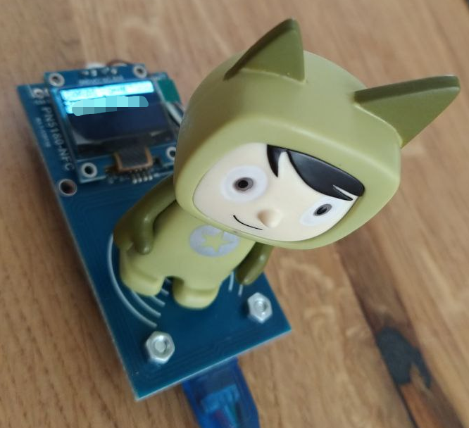
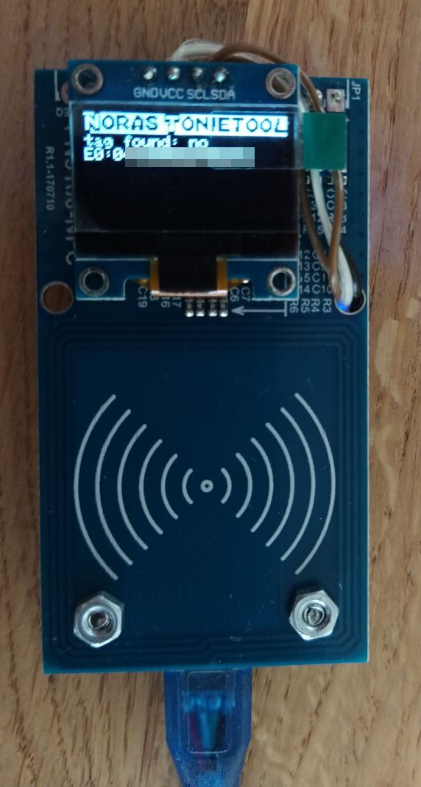
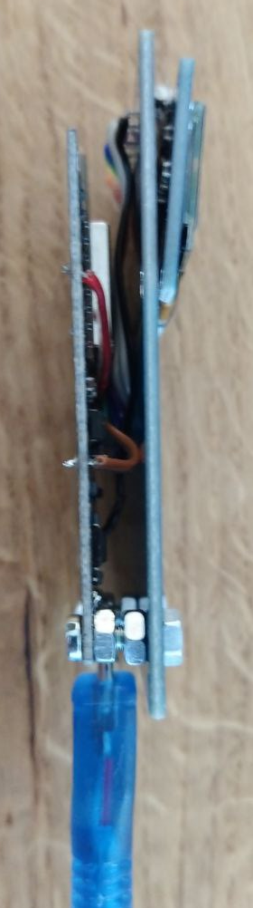
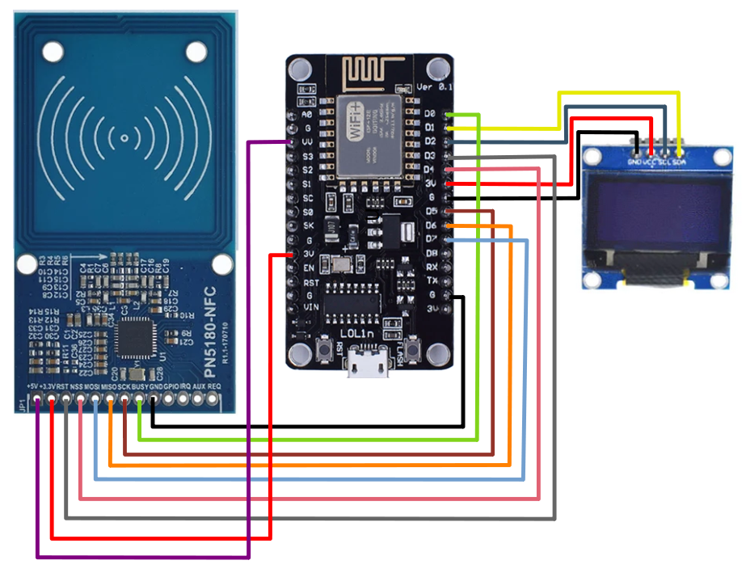

# ESP8266_PN5180_Tonietool

## Introduction

This repository holds resources to build a cheap NFC reader tool "Tonietool" that can read UID numbers from Tonie figurines. It can be used with the [teddy bench](https://github.com/toniebox-reverse-engineering/teddy) software to build DIY Tonie figurines that can play custom content. The general function can be seen in the following pictures:

  

## DIY steps

### Obtain these parts
* PN5180 board (e.g. [this](https://de.aliexpress.com/item/4001263492857.html) for 5.00$)
* ESP8266 NodeMCU board (e.g. [this](https://www.aliexpress.com/item/32554198757.html) for 4.50$)
* 0.96" 128x64px I²C display (bundled with NodeMCU board in above link)
* (soldering iron, stranded wire, pliers, screws & nuts, hot glue, ...)

### Assemble the hardware

* De-solder pin headers if necessary, be aware of [some pitfalls with cheap displays](https://www.youtube.com/watch?v=wx2SWfFeppc).
* Use soldering iron and stranded wire to connect parts according to the following schema (all parts use 3.3V logic, no level shifters needed):

* Do mechanical assembly using screws and nuts and hot glue. Be careful to use small screws and nuts so as not to damage the electronic components on the boards.

(For the lazy: patching everything up on a breadboard should also work.)

### Setup of IDE
* Ensure that your PC has drivers for CH340 USB-to-serial chip installed. On linux it can be fiddly, make sure you have the correct [rights](https://support.arduino.cc/hc/en-us/articles/360016495679-Fix-port-access-on-Linux) and no [conflicting packages](https://stackoverflow.com/questions/70123431/why-would-ch341-uart-is-disconnected-from-ttyusb).
* Install Arduino IDE.
* Add support package for ESP8266 NodeMCU board, see [instructions](https://blog.opendatalab.de/codeforbuga/2016/07/02/arduino-ide-mit-nodemcu-esp8266) and [board manager url](http://arduino.esp8266.com/stable/package_esp8266com_index.json).
* In library manager add "Adafruit SSD1306". Choose "Select all" when asked to install additional dependencies "Adafruit BusIO" and "Adafruit GFX Library".
* Add library "[PN5180-Library](https://github.com/ATrappmann/PN5180-Library/)" from zip file using the "Sketch" menu.

### Compile and upload MCU software
* Open sketch "tonietool.ino" and select board "NodeMCU 1.0"
* Enter correct password to the placeholder in file `include/password.hpp`. You may find the password on [ifixit](https://de.ifixit.com/Antworten/Ansehen/513422/nfc+Chips+f%C3%BCr+tonies+kaufen?permalink=answer-617274#answer617274) or [github](https://github.com/toniebox-reverse-engineering/teddy/issues/19) or through google. If it doesn't work, try to reverse the byte order.
* Click the check button to test if the sketch can compile successfully.
* Connect Tonietool device to USB, select correct serial port in Arduino IDE depending on your system configuration.
* Click the upload button.

### Usage

Connect to USB socket, the device should boot up and show a short animation on the screen. Place Tonie figurine on NFC antenna and it should show the UID as in the above images. For troubleshooting, there is additional debug information available from the UART that can be accessed e.g. with [TeraTerm](https://ttssh2.osdn.jp) or similar tools.

### Contribute

If you want to contribute to this project open an issue or a PR or drop a message. The current state is more like a first functional prototype and many parts could be improved.
